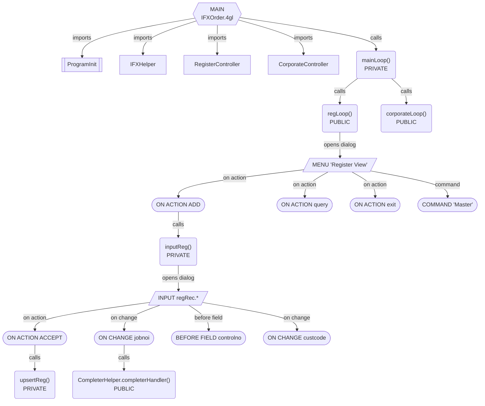

# Feasibility Report: Genero Application Diagram — VS Code Extension

**Date:** 2026-05-22  
**Reference project:** `C:\work\VsCode\support\ats-mfg-mgr`  
**Entry point analysed:** `src/IFXOrder.4gl`  
**Genero information source:** GeneroIntelligence MCP (Genero BDL 6.00 / skills verified against 5.00)

---

## 1. Goal

Build a VS Code extension that:

1. Takes a `.4gl` file containing a `MAIN` block as the entry point.
2. Resolves all `IMPORT FGL` dependencies that exist in the workspace.
3. Parses each resolved module for function/method declarations, dialog blocks, and access points.
4. Produces a dependency + call-flow diagram that shows:
   - Which modules are imported and how they connect.
   - The signature of every in-project function (name, visibility, parameters, return types).
   - How each function is reached: via `ON ACTION`, `COMMAND`, field event (`ON CHANGE`, `BEFORE/AFTER FIELD`), or direct `CALL`.
5. Renders the diagram in a VS Code WebviewPanel.

Only symbols that resolve to files inside the workspace are expanded. External references (stdlib, `util.*`, `ui.*`, GBC libraries) appear as leaf nodes.

---

## 2. Reference Project Characteristics

| Metric | Value |
|--------|-------|
| Total `.4gl` files | 119 |
| Source folders | `src/`, `BOL/` |
| Form files (`.per`) | ~40+ |
| Entry point | `IFXOrder.4gl` (has `MAIN`) |
| Direct imports from entry | 9 modules |
| Architectural pattern | State-machine dispatcher → per-tab Controller loop → MENU/INPUT/CONSTRUCT |

### Entry point structure (`IFXOrder.4gl`)

```
MAIN
  ├─ IMPORT FGL ProgramInit
  ├─ IMPORT FGL UserHelper
  ├─ IMPORT FGL IFXHelper
  ├─ IMPORT FGL CorporateController
  ├─ IMPORT FGL FacilityController
  ├─ IMPORT FGL JobController
  ├─ IMPORT FGL POController
  ├─ IMPORT FGL RegisterController
  └─ IMPORT FGL LineItemController
       │
       └─ OPEN WINDOW mainWindow WITH FORM "IFXOrderForm"
       └─ CALL mainLoop()
              └─ CASE currentState.currentTab
                    ├─ CorporateController.corporateLoop()
                    ├─ FacilityController.facilityLoop()
                    ├─ JobController.jobLoop()
                    ├─ POController.poLoop()
                    ├─ RegisterController.regLoop()
                    └─ LineItemController.itemLoop()
```

---

## 3. Genero Language Constructs to Parse

All syntax below is verified against GeneroIntelligence (authoritative source). Training-data assumptions are not used.

### 3.1 Module Imports

```4gl
IMPORT FGL module-name
IMPORT FGL module-name AS alias-name
IMPORT FGL package.path.module-name
IMPORT FGL package.path.*
```

**Key rules (from GeneroIntelligence):**
- Identifiers are **case-sensitive**.
- An aliased import means all calls use `alias.function()` — the parser must track alias→module mappings.
- The `.*` wildcard form imports all modules in a package directory.
- Module name maps 1:1 to a `.4gl` file: `IMPORT FGL RegisterController` → look up `RegisterController.4gl` anywhere in the workspace.

### 3.2 Function Declarations

Three syntactic forms:

```4gl
-- Regular function
PUBLIC FUNCTION name(param1 TYPE1, param2 TYPE2) RETURNS(TYPE)
PRIVATE FUNCTION name(param1 TYPE1) RETURNS(TYPE1, TYPE2)

-- Type-bound method
PUBLIC FUNCTION (self TTypeName) methodName(param TYPE) RETURNS(TYPE)

-- No return value
PUBLIC FUNCTION name() RETURNS()
```

**Key rules (from GeneroIntelligence):**
- `PUBLIC` = accessible from other modules via qualified call `Module.name()`.
- `PRIVATE` = module-internal only; cannot be called cross-module.
- Type-bound methods belong to a named type; their "module" is the file where `TYPE TTypeName RECORD ... END RECORD` is declared.
- `RETURNS()` with empty parens = void.

### 3.3 MENU / COMMAND (access mode: menu)

```4gl
MENU "title" [ATTRIBUTES(STYLE="dialog", COMMENT="...", IMAGE="...")]
    BEFORE MENU
        -- setup code
    ON ACTION action-name [ATTRIBUTES(TEXT="...", ACCELERATOR="...")]
        CALL someFunction()
    COMMAND "label" [ATTRIBUTES(...)]
        CALL someFunction()
END MENU
```

**Key rules (from GeneroIntelligence):**
- `ON ACTION` inside MENU triggers on toolbar/button click or accelerator key.
- `COMMAND` is a text-menu item (older style, still valid and used in this project).
- `BEFORE MENU` is a setup hook, not a user-initiated access point.
- `ON ACTION` can have `ATTRIBUTES(TEXT, IMAGE, COMMENT, ACCELERATOR, DEFAULTVIEW, CONTEXTMENU, ROWBOUND, VALIDATE)`.

### 3.4 INPUT / INPUT BY NAME (access mode: input dialog)

```4gl
-- Positional form (used in this project)
INPUT record.* [WITHOUT DEFAULTS] FROM screen_fields.* [ATTRIBUTES(UNBUFFERED)]

-- BY NAME form
INPUT BY NAME variable_list [ATTRIBUTES(UNBUFFERED, WITHOUT DEFAULTS)]
```

Control blocks inside INPUT:
```4gl
    BEFORE INPUT
    AFTER INPUT
    BEFORE FIELD fieldname
    AFTER FIELD fieldname [, fieldname2 ...]
    ON ACTION action-name [INFIELD fieldname]
    ON CHANGE fieldname [, fieldname2 ...]
    ON KEY (key-name)
```

**Key rules (from GeneroIntelligence):**
- `UNBUFFERED` attribute: variables and form fields sync automatically.
- `ON CHANGE` fires immediately for COMBOBOX, CHECKBOX, RADIOGROUP, SPINEDIT, SLIDER, DATEEDIT; fires on field leave for EDIT/BUTTONEDIT (unless a COMPLETER is attached, then fires on each keystroke).
- `ON CHANGE` can list multiple fields: `ON CHANGE quantity, unit_price`.
- `AFTER FIELD` supports multiple fields: `AFTER FIELD calcpric, matpric, frtpric` (seen in `RegisterController.4gl`).
- `ON ACTION zoom INFIELD fieldname` — field-specific variant of ON ACTION.
- **Do NOT use `ON CHANGE` for validation with `NEXT FIELD`** — use `AFTER FIELD` instead (GeneroIntelligence pitfall note).

### 3.5 CONSTRUCT (access mode: query builder)

```4gl
-- BY NAME form
CONSTRUCT BY NAME where_clause ON table.col1, table.col2

-- Positional form (used in this project)
CONSTRUCT where_clause ON table.col1, table.col2, ... FROM screen_rec.*
```

Control blocks:
```4gl
    BEFORE CONSTRUCT
    AFTER CONSTRUCT
    ON ACTION action-name
```

**Key rules (from GeneroIntelligence):**
- `CONSTRUCT BY NAME` does **not** take a `FROM` clause — common mistake.
- The positional form (`FROM screen_rec.*`) is valid and used in `RegisterController.4gl`.
- Generates a SQL WHERE clause string; subsequent query execution is a separate CALL.
- `AFTER CONSTRUCT` fires when the user presses Accept (or `int_flag` is set on cancel).

### 3.6 DISPLAY ARRAY (access mode: list view)

```4gl
DISPLAY ARRAY array_name TO screen_record.* [ATTRIBUTES(UNBUFFERED, FOCUSONFIELD, DOUBLECLICK=action-name)]
    BEFORE ROW
    ON ACTION action-name
    ON UPDATE
    ON INSERT / ON APPEND
    ON DELETE
END DISPLAY
```

**Key rules (from GeneroIntelligence):**
- `BEFORE ROW` fires when the current row changes — commonly used to load detail data.
- `ON UPDATE`, `ON INSERT`, `ON APPEND`, `ON DELETE` are CRUD event triggers.
- `DOUBLECLICK=action-name` binds a double-click or Enter to a named action.

### 3.7 DIALOG (combined dialogs)

```4gl
DIALOG [ATTRIBUTES(UNBUFFERED)]
    INPUT record.* FROM sr_header.*
    END INPUT
    DISPLAY ARRAY lines TO sr_lines.*
        BEFORE ROW
            -- sync detail when master row changes
    END DISPLAY
    ON ACTION save
        CALL save_order()
        EXIT DIALOG
END DIALOG
```

**Key rules (from GeneroIntelligence):**
- `ON ACTION` at the outer DIALOG level is valid and fires regardless of which sub-dialog is active.
- `ON CHANGE` is **not** valid at the outer DIALOG level — only inside INPUT sub-dialogs.
- Used for master-detail forms (as in `IFXOrder.4gl`'s tab structure).

### 3.8 FUNCTION Reference Passing

```4gl
CALL displayState(FUNCTION regRange)
```

The `FUNCTION` keyword passes a function as a first-class reference. The parser must recognise this to avoid tagging `regRange` as a regular callee. The referenced function is a dependency edge of type `function-reference`, not a direct call.

---

## 4. Node and Edge Taxonomy

### Node types

| Type | Shape (Mermaid) | Description |
|------|----------------|-------------|
| `entry` | `{{MAIN}}` hexagon | The MAIN block of the entry `.4gl` file |
| `module` | `[ModuleName]` rectangle | A resolved `.4gl` source file |
| `function` | `(funcName())` rounded rect | A FUNCTION or type method; labelled with visibility and signature |
| `menu` | `[/MENU "title"/]` parallelogram | A MENU block |
| `input` | `[/INPUT rec.*/]` parallelogram | An INPUT or INPUT BY NAME block |
| `construct` | `[/CONSTRUCT/]` parallelogram | A CONSTRUCT block |
| `display_array` | `[/DISPLAY ARRAY/]` parallelogram | A DISPLAY ARRAY block |
| `dialog` | `[/DIALOG/]` parallelogram | A combined DIALOG block |
| `action` | `([ON ACTION name])` stadium | An ON ACTION handler |
| `command` | `([COMMAND "text"])` stadium | A COMMAND item |
| `field_event` | `([ON CHANGE field])` stadium | ON CHANGE / BEFORE FIELD / AFTER FIELD handler |
| `external` | `[[ExternalModule]]` double-rect | Reference to a module not found in the workspace |

### Edge types

| Type | Label | Description |
|------|-------|-------------|
| `imports` | `imports` | IMPORT FGL relationship |
| `calls` | `calls` | Direct CALL statement |
| `opens` | `opens dialog` | Function contains / opens a dialog block |
| `triggers` | `on action` / `command` / `on change` | Access point triggers a CALL |
| `function_ref` | `function ref` | FUNCTION keyword reference (not a call) |
| `navigates` | `→ tab: Register` | Tab navigation via state machine (setTab) |

---

## 5. Parsing Strategy

### 5.1 Approach: Regex lexer with context stack

A full parser/AST is not required for this project's codebase. The patterns are regular and consistent. A **context-aware regex lexer** with a stack-based context tracker handles everything:

```
Context stack examples:
  [] → top level
  [FUNCTION:regLoop] → inside a function body
  [FUNCTION:regLoop, MENU:"Register View"] → inside a MENU inside a function
  [FUNCTION:inputReg, INPUT:regRec] → inside an INPUT block
  [FUNCTION:inputReg, INPUT:regRec, ON_ACTION:ACCEPT] → inside an action handler
```

When the parser sees a `CALL` statement, it checks the context stack to determine:
- Which function it is inside (to create the caller→callee edge).
- Which access point (if any) owns the CALL (to label the edge type).

### 5.2 Module resolution algorithm

```
1. Parse all IMPORT FGL statements from the entry file.
2. For each import:
   a. Strip package path prefix if present (e.g., com.myapp.core.ModuleA → ModuleA).
   b. Search workspace recursively for <ModuleName>.4gl.
   c. If found → add to resolved set, recurse into it.
   d. If not found → mark as external leaf.
3. Track alias mappings: IMPORT FGL Foo AS f → alias["f"] = "Foo".
4. When a CALL uses an alias prefix, resolve it to the actual module name.
```

### 5.3 Function signature extraction regex

```typescript
// Regular function
/^(PUBLIC|PRIVATE)\s+FUNCTION\s+(\w+)\s*\((.*?)\)\s+RETURNS\s*\((.*?)\)/im

// Type-bound method
/^(PUBLIC|PRIVATE)\s+FUNCTION\s+\(\s*\w+\s+(\w+)\s*\)\s+(\w+)\s*\((.*?)\)\s+RETURNS\s*\((.*?)\)/im

// End of function
/^END\s+FUNCTION/im
```

### 5.4 Dialog block detection

```typescript
// MENU
/^MENU\s+"([^"]+)"(?:\s+ATTRIBUTES\s*\(([^)]*)\))?/im

// INPUT (positional)
/^INPUT\s+(\S+)\s+(?:WITHOUT\s+DEFAULTS\s+)?FROM\s+(\S+)/im

// INPUT BY NAME
/^INPUT\s+BY\s+NAME\s+(.+?)(?:\s+ATTRIBUTES)?/im

// CONSTRUCT
/^CONSTRUCT\s+(?:BY\s+NAME\s+)?(\w+)\s+ON\s+(.+?)(?:\s+FROM\s+\S+)?$/im

// DISPLAY ARRAY
/^DISPLAY\s+ARRAY\s+(\w+)\s+TO\s+(\S+)/im

// DIALOG
/^DIALOG(?:\s+ATTRIBUTES\s*\(.*?\))?$/im
```

### 5.5 Access point extraction

```typescript
// ON ACTION (with optional INFIELD and ATTRIBUTES)
/^ON\s+ACTION\s+(\w+)(?:\s+INFIELD\s+(\w+))?(?:\s+ATTRIBUTES\s*\(([^)]*)\))?/im

// COMMAND
/^COMMAND\s+"([^"]+)"(?:\s+ATTRIBUTES\s*\(([^)]*)\))?/im

// ON CHANGE (single or multiple fields)
/^ON\s+CHANGE\s+([\w,\s]+)/im

// BEFORE / AFTER FIELD (single or multiple)
/^(BEFORE|AFTER)\s+FIELD\s+([\w,\s]+)/im

// BEFORE / AFTER MENU, INPUT, CONSTRUCT, ROW
/^(BEFORE|AFTER)\s+(MENU|INPUT|CONSTRUCT|ROW)/im
```

### 5.6 CALL statement extraction

```typescript
// Cross-module call: Module.function() or alias.function()
/^CALL\s+(\w+)\.(\w+)\s*\(/im

// Type method call: variable.method() — NOT a cross-module call
// Distinguishable because the prefix is a variable name, not a module alias

// Local call
/^CALL\s+(\w+)\s*\(/im

// FUNCTION reference (NOT a call — must be excluded from call edges)
/\bFUNCTION\s+(\w+)/im
```

---

## 6. Diagram Design

### 6.1 Format

**Primary:** Mermaid `flowchart TD` rendered in a VS Code WebviewPanel via the Mermaid CDN or bundled JS.

**Why Mermaid:**
- Native support in VS Code Markdown preview and many extensions.
- Auto-layout handles large graphs.
- Supports node shapes, edge labels, and click events (via `click` directive).
- Can be exported as SVG/PNG.

### 6.2 Sample diagram (IFXOrder.4gl, depth 1)



### 6.3 Depth control

| Setting | Behaviour |
|---------|-----------|
| Depth 0 | Entry module only: MAIN + direct IMPORT FGL edges |
| Depth 1 | MAIN + all directly imported modules + their public functions |
| Depth 2 | Depth 1 + functions called from depth-1 functions (recommended default) |
| Unlimited | Full transitive closure (may be very large for 119-file projects) |

### 6.4 Filtering options

- Show/hide PRIVATE functions.
- Show/hide field events (ON CHANGE, BEFORE/AFTER FIELD) — can add noise.
- Filter by module name (show only selected controllers).
- Collapse external modules (show as single leaf node).

---

## 7. Implementation Architecture

### 7.1 Extension structure

```
genero-app-diagram/
├── src/
│   ├── extension.ts          # VS Code extension entry point, command registration
│   ├── parser/
│   │   ├── ModuleResolver.ts  # IMPORT FGL → file path lookup
│   │   ├── FglParser.ts       # Single-file regex lexer with context stack
│   │   └── GraphBuilder.ts    # Assembles parsed data into a node/edge graph
│   ├── diagram/
│   │   ├── MermaidRenderer.ts # Graph → Mermaid syntax string
│   │   └── webview.ts         # WebviewPanel creation and HTML template
│   └── types.ts               # Node, Edge, ParsedModule, FunctionSignature types
├── media/
│   └── mermaid.min.js         # Bundled Mermaid (or loaded via CDN)
└── package.json
```

### 7.2 Extension command

Registered as:
- **Command palette**: `Genero: Generate Application Diagram`
- **Context menu** (`.4gl` files in Explorer): `Generate Application Diagram`
- **Condition**: only shown when the active file has a `.4gl` extension

The command reads the active editor's file path (or the right-clicked file) as the entry point.

### 7.3 WebviewPanel features

- Mermaid diagram with zoom/pan (via `mermaid.js` click-to-navigate).
- Depth selector (0–5 + unlimited).
- Module filter checkboxes.
- Toggle: show/hide PRIVATE functions.
- Toggle: show/hide field events.
- "Export as SVG" button.
- Clicking a node opens the corresponding `.4gl` file in the editor at the function's line number.

---

## 8. Non-Trivial Challenges and Mitigations

### 8.1 Type method resolution

**Problem:** `IFXHelper.currentState.init()` — `currentState` is a variable of type `TCurrentState`, whose methods are defined in `IFXHelper.4gl`. The call looks like a cross-module call but is actually a method dispatch on a type instance.

**Mitigation:** During the parse pass, build a type registry: `{module → [TypeName]}` and a variable registry: `{module → {varName → TypeName}}`. When resolving `Module.var.method()`, check if `var` is a known variable of a known type. If yes, resolve `method` as a type method of `TypeName` (defined in `Module`).

### 8.2 IMPORT FGL with alias

**Problem:** `IMPORT FGL RegisterController AS rc` → calls appear as `rc.regLoop()` not `RegisterController.regLoop()`.

**Mitigation:** Parser maintains `aliasMap: {alias → moduleName}`. All call resolution goes through this map first.

### 8.3 FUNCTION reference vs CALL

**Problem:** `CALL displayState(FUNCTION regRange)` — `regRange` appears after the `FUNCTION` keyword but is not being called; it's being passed as a value.

**Mitigation:** The regex for CALL extraction explicitly excludes matches preceded by `FUNCTION `. A separate regex captures `FUNCTION <name>` as a `function-reference` edge.

### 8.4 Tab navigation via state machine

**Problem:** The tab-switching pattern `CALL IFXHelper.currentState.setTab(IFXHelper.cIFXRegister)` is indirect. The constant `cIFXRegister = "Register"` determines which controller runs next, but the connection is through the `mainLoop()` CASE statement, not a direct CALL.

**Mitigation:** Detect `setTab(IFXHelper.cIFX*)` calls and resolve the constant to its string value. Render as a dashed `navigates to` edge in the diagram rather than a solid `calls` edge.

### 8.5 Graph size for large projects

**Problem:** Full traversal of 119 files with all function calls could produce hundreds of nodes.

**Mitigation:** Default depth = 2. Lazy expansion: in the WebviewPanel, nodes can be double-clicked to expand one more level. Module-level grouping (Mermaid `subgraph`) to cluster related functions.

### 8.6 Multi-field event handlers

**Problem:** `AFTER FIELD calcpric, matpric, frtpric` — a single handler for multiple fields. Same for `ON CHANGE quantity, unit_price`.

**Mitigation:** The parser splits comma-separated field names and creates one access-point node per field, all pointing to the same handler body's calls.

---

## 9. Implementation Plan

### Phase 1 — MVP (entry point + direct imports + menus/actions)

- [ ] VS Code extension scaffold (TypeScript, package.json, command)
- [ ] `ModuleResolver`: workspace file scan, IMPORT FGL → file path, alias tracking
- [ ] `FglParser`: function declarations, MENU/INPUT/CONSTRUCT/DISPLAY ARRAY blocks, ON ACTION, COMMAND, CALL statements
- [ ] `GraphBuilder`: assemble nodes and edges, depth limiting
- [ ] `MermaidRenderer`: graph → Mermaid `flowchart TD` string
- [ ] `WebviewPanel`: render Mermaid, depth selector, module filter
- [ ] Test against `IFXOrder.4gl` through depth 2

**Expected output:** A working diagram showing MAIN → 9 controllers → their `xxxLoop()` functions → MENU blocks → ON ACTION handlers → called functions, with signatures.

### Phase 2 — Full event coverage

- [ ] `ON CHANGE` field events (single and multi-field)
- [ ] `BEFORE FIELD` / `AFTER FIELD` field events (single and multi-field)
- [ ] `BEFORE MENU` / `BEFORE INPUT` / `BEFORE CONSTRUCT` setup hooks
- [ ] `DIALOG` combined dialog blocks with sub-dialog attribution
- [ ] `ON UPDATE` / `ON INSERT` / `ON DELETE` DISPLAY ARRAY CRUD triggers
- [ ] `BEFORE ROW` trigger attribution

### Phase 3 — Type method resolution and navigation edges

- [ ] Type registry: parse `PUBLIC TYPE TName RECORD ... END RECORD`
- [ ] Variable registry: parse module-level `DEFINE varName TTypeName`
- [ ] Resolve `Module.var.method()` chains to type-bound methods
- [ ] Detect `setTab(cIFX*)` patterns and render as navigation edges
- [ ] FUNCTION reference edges (not calls)

### Phase 4 — Interactive diagram

- [ ] Click node → open `.4gl` file at function line number
- [ ] Expand/collapse nodes on double-click
- [ ] `subgraph` clustering by module
- [ ] Export as SVG / PNG
- [ ] `.per` form cross-reference: `OPEN WINDOW ... WITH FORM "FormName"` → link to `FormName.per`

---

## 10. Verdict

**Fully feasible.** The `ats-mfg-mgr` project uses a consistent, pattern-regular architecture that a context-aware regex lexer can parse accurately without requiring a full Genero AST. All dialog constructs, access modes, and function signature forms have been verified against GeneroIntelligence as the authoritative source.

The main implementation effort:

| Component | Estimated size |
|-----------|---------------|
| Regex lexer with context stack | ~400 lines |
| Module resolver | ~80 lines |
| Graph builder | ~200 lines |
| Mermaid renderer | ~150 lines |
| WebviewPanel + HTML | ~200 lines |
| VS Code extension boilerplate | ~100 lines |
| **Total Phase 1** | **~1 130 lines** |

A working Phase 1 MVP that diagrams `IFXOrder.4gl` through depth 2 (showing all controllers, their menus, actions, and direct function calls with signatures) is achievable in a single focused implementation session.
